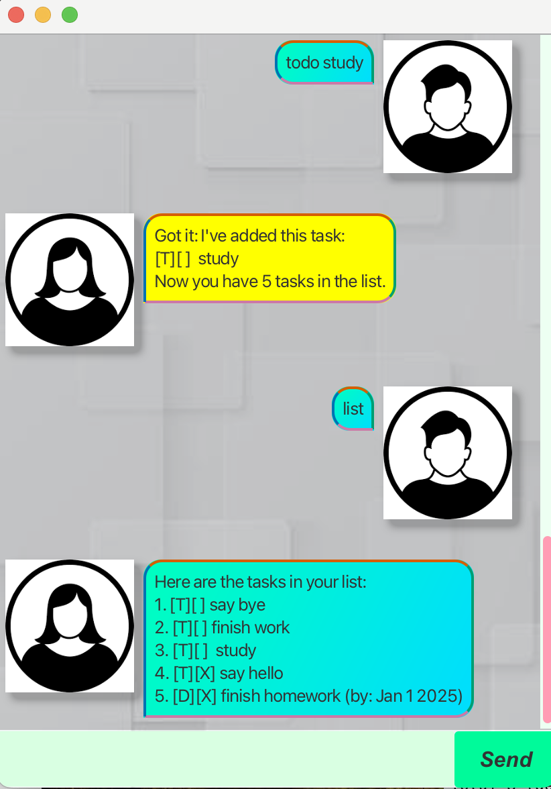

# <span style="color:orange">Eva User Guide</span> 



Eva is a desktop app for managing tasks, optimized for use via a Command Line Interface (CLI) while still having the benefits of a Graphical User Interface (GUI). If you can type fast, Eva can help you manage your tasks faster than traditional GUI apps!

Eva can help manage three types of tasks:
1. Todos
    -   Todo tasks are simple tasks that you have to complete but do not have any date or time attached to them.
2. Deadlines
    -   Deadline tasks are tasks that need to be done before a specific date and time.
3. Events
    -   Event tasks are tasks that start at a specific time and end at a specific time.

## <span style="color:orange">Quick Start</span> 

1. Ensure you have Java `17` or above installed in your Computer.<br>**Mac users**: Ensure you have the precise JDK version prescribed [here](https://se-education.org/guides/tutorials/javaInstallationMac.html).
2. Download the latest `eva.jar` release from [here](https://github.com/farhan-navas/ip/releases).
3. Copy the file to the folder you want to use as the home folder for Eva.
4. Open a command terminal, navigate to the folder where `eva.jar` is located and run the command `java -jar eva.jar`. 
5. A GUI similar to the one shown above should appear. You can now start using Eva.
6. Type the command in the command box and press Enter to execute it. Some example commands you can try:
    - `todo Read Harry Potter`: Adds a todo task with the description `Read Harry Potter`.
    - `list`: Lists all tasks.
    - `delete 1`: Deletes the 1st task shown in the current list.
    - `bye`: Exits the app.
7. Refer to the [Features](#app-features) section below for details of each command.

## <a id="app-features"><span style="color:orange">Features</span></a>

### <span style="color:orange">Adding todos: `todo`</span>
\
To add a todo task, type `todo` followed by the description of the task. Say we have a new task to read Harry Potter. We can add it by simply typing:

```
todo Read Harry Potter 
```

Eva will respond by saying:

```
Got it. I've added this task:
[T][ ] Read Harry Potter
Now you have 1 task in the list.
```

Format: `todo DESCRIPTION`

### <span style="color:orange">Adding deadlines: `deadline`</span> 
\
To add a deadline task, type `deadline` followed by the description of the task and the deadline. Say we have a new task to submit a report by 11:59pm on 20th October 2021. We can add it by typing:

```
deadline Submit report /by 2021-10-20 23:59
```

Eva will respond by saying:

```
Got it. I've added this task:
[D][ ] Submit report (by: 20 Oct 2021, 11:59 PM)
Now you have 2 tasks in the list.
```

Format: `deadline DESCRIPTION /by YYYY-MM-DD HH:MM`

### <span style="color:orange">Adding events: `event`</span> 
\
To add an event task, type `event` followed by the description of the task and the event time. Say we have a new task to attend a meeting on 20th October 2021 from 2pm to 4pm. We can add it by typing:

```
event Attend meeting /from 2021-10-20 14:00 /to 2021-10-20 16:00
```

Eva will respond by saying:

```
Got it. I've added this task:
[E][ ] Attend meeting (from: 20 Oct 2021, 2:00 PM to: 20 Oct 2021, 4:00 PM)
Now you have 3 tasks in the list.
```

Format: `event DESCRIPTION /from YYYY-MM-DD HH:MM /to YYYY-MM-DD HH:MM`

### <span style="color:orange">Listing all tasks: `list`</span> 
\
To see all the tasks you have added, type `list`. Eva will respond by showing you all the tasks you have added.

```
Here are the tasks in your list:
1. [T][ ] Read Harry Potter
2. [D][ ] Submit report (by: 20 Oct 2021, 11:59 PM)
3. [E][ ] Attend meeting (from: 20 Oct 2021, 2:00 PM to: 20 Oct 2021, 4:00 PM)
```

Format: `list`

### <span style="color:orange">Marking a task as done: `mark`</span> 
\
To mark a task as done, type `mark` followed by the task number. Say we have completed the task to read Harry Potter. We can mark it as done by typing:

```
mark 1
```

Eva will respond by saying:

```
Nice! I've marked this task as done:
[T][X] Read Harry Potter
```

Format: `mark TASK_NUMBER`

### <span style="color:orange">Marking a task as undone: `unmark`</span> 
\
To mark a task as undone, type `unmark` followed by the task number. Say we have not completed the task to read Harry Potter. We can mark it as undone by typing:

```
unmark 1
```

Eva will respond by saying:

```
Nice! I've marked this task as undone:
[T][ ] Read Harry Potter
```

Format: `unmark TASK_NUMBER`

### <span style="color:orange">Deleting a task: `delete`</span> 
\
To delete a task, type `delete` followed by the task number. Say we want to delete the task to read Harry Potter. We can delete it by typing:

```
delete 1
```

Eva will respond by saying:

```
Noted. I've removed this task:
[T][ ] Read Harry Potter
Now you have 2 tasks in the list.
```

Format: `delete TASK_NUMBER`

### <span style="color:orange">Finding tasks: `find`</span> 
\
To find tasks that contain a specific keyword, type `find` followed by the keyword. Say we want to find tasks that contain the keyword `report`. We can find it by typing:

```
find report
```

Eva will respond by showing you all the tasks that contain the keyword `report`.

```
Here are the matching tasks in your list:
1. [D][ ] Submit report (by: 20 Oct 2021, 11:59 PM)
```

Format: `find KEYWORD`

### <span style="color:orange">Exiting the app: `bye`</span> 
\
To exit the app, type `bye`. Eva will respond by saying goodbye and automatically closing the app.

```
Bye. Hope to see you again soon!
```

Format: `bye`
